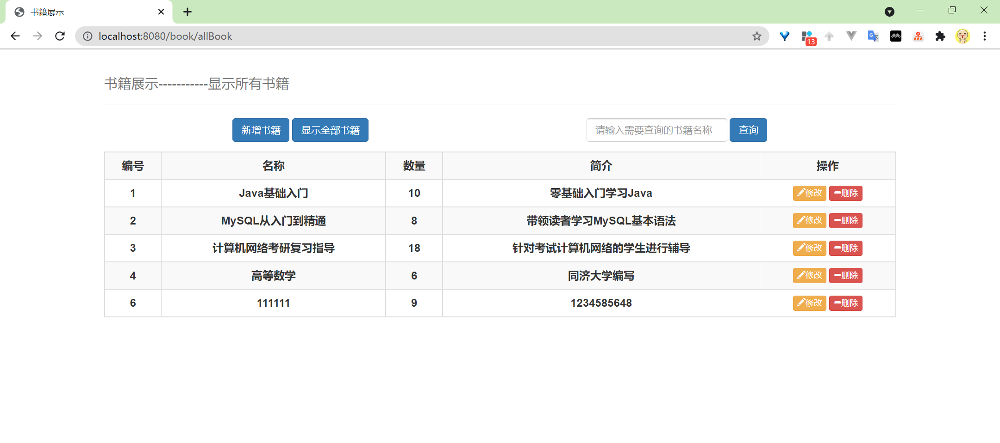
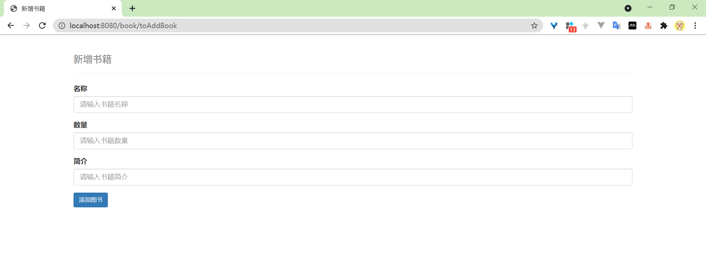
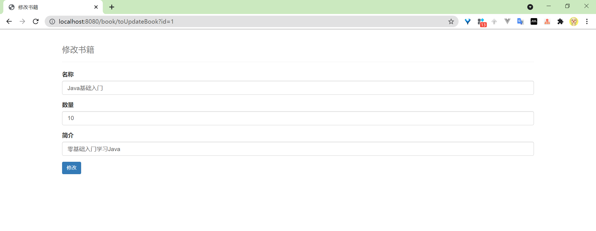
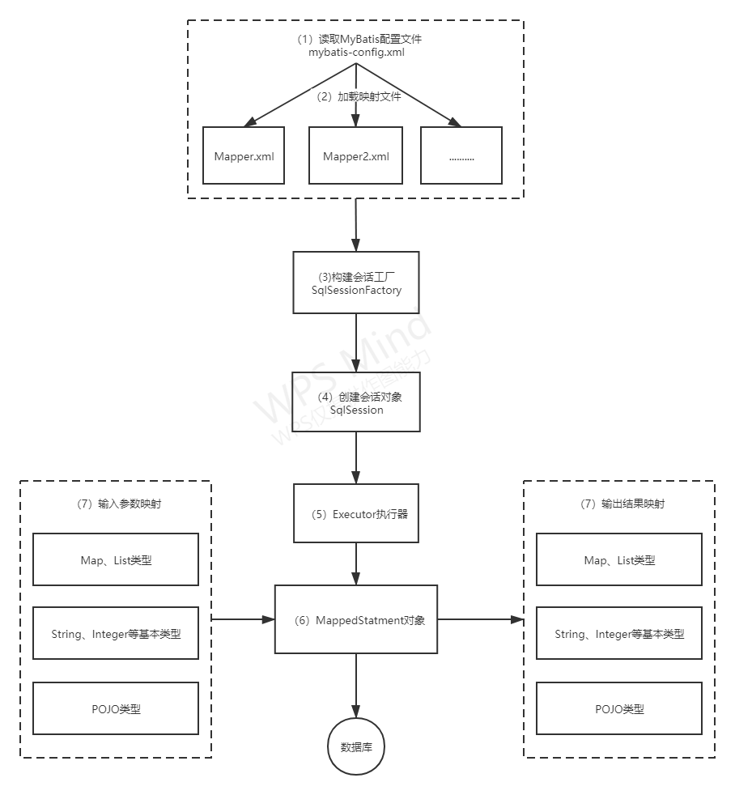
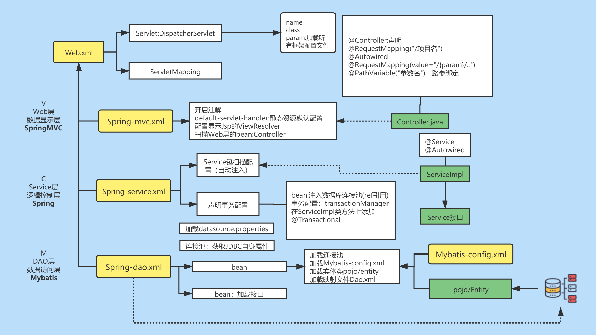

## SSM-BookManagerSys

# 图书管理系统SSM-CRUD

SSM项目实战，一个微型CRUD的图书管理系统。

### 一、效果图

+ 首页
  

+ 新增书籍
  

+ 修改书籍
  

+ 查询书籍
  

### 二、SSM介绍

> SSM（Spring+SpringMVC+MyBatis）框架集由Spring、MyBatis两个开源框架整合而成（SpringMVC是Spring中的部分内容）。
> 常作为数据源较简单的web项目的框架。

+ Spring

  Spring就像是整个项目中装配bean的大工厂，在配置文件中可以指定使用特定的参数去调用实体类的构造方法来实例化对象。也可以称之为项目中的粘合剂。
  Spring的核心思想是IoC（控制反转），即不再需要程序员去显式地new一个对象，而是让Spring框架帮你来完成这一切。

+ Spring MVC

  SpringMVC在项目中拦截用户请求，它的核心Servlet即DispatcherServlet承担中介或是前台这样的职责，将用户请求通过HandlerMapping去匹配Controller，
  Controller就是具体对应请求所执行的操作。SpringMVC相当于SSH框架中struts。

+ Mybatis

  MyBatis是对jdbc的封装，它让数据库底层操作变的透明。MyBatis的操作都是围绕一个sqlSessionFactory实例展开的。MyBatis通过配置文件关联到各实体类的Mapper文件，
  Mapper文件中配置了每个类对数据库所需进行的sql语句映射。在每次与数据库交互时，通过sqlSessionFactory拿到一个sqlSession，再执行sql命令。
  页面发送请求给控制器，控制器调用业务层处理逻辑，逻辑层向持久层发送请求，持久层与数据库交互，后将结果返回给业务层，业务层将处理逻辑发送给控制器，控制器再调用视图展现数据。

+ 实现原理图

  `Mybatis原理图`
  

  `SSM原理图`
  